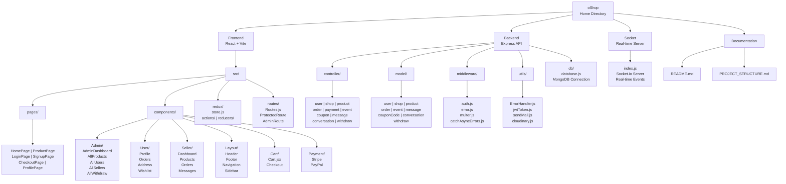

# Project Structure & Quick Reference Guide

## Project Directory Tree - CORE Structure



---

## Text Format Structure - Sub Components

### Frontend src/ Structure
```
src/
├── pages/
│   ├── HomePage.jsx
│   ├── ProductPage.jsx
│   ├── ProductDetailsPage.jsx
│   ├── LoginPage.jsx
│   ├── SignupPage.jsx
│   ├── CheckoutPage.jsx
│   ├── ProfilePage.jsx
│   ├── OrderDetailsPage.jsx
│   ├── CartPage.jsx
│   ├── UserInbox.jsx
│   ├── TrackOrderPage.jsx
│   └── EventsPage.jsx
│
├── components/
│   ├── Admin/
│   │   ├── AdminDashboardMain.jsx
│   │   ├── AllProducts.jsx
│   │   ├── AllUsers.jsx
│   │   ├── AllSellers.jsx
│   │   ├── AllEvents.jsx
│   │   └── AllWithdraw.jsx
│   │
│   ├── User/
│   │   ├── Profile.jsx
│   │   ├── Orders.jsx
│   │   ├── Address.jsx
│   │   └── Wishlist.jsx
│   │
│   ├── Seller/
│   │   ├── SellerDashboard.jsx
│   │   ├── Products.jsx
│   │   ├── Orders.jsx
│   │   └── Messages.jsx
│   │
│   ├── Layout/
│   │   ├── Header.jsx
│   │   ├── Footer.jsx
│   │   ├── Navigation.jsx
│   │   └── Sidebar.jsx
│   │
│   ├── Cart/
│   │   └── Cart.jsx
│   │
│   ├── Payment/
│   │   ├── Stripe.jsx
│   │   └── PayPal.jsx
│   │
│   ├── Login/
│   ├── Signup/
│   ├── Products/
│   ├── Shop/
│   ├── WishList/
│   └── Checkout/
│
├── redux/
│   ├── store.js
│   ├── actions/
│   └── reducers/
│
├── routes/
│   ├── Routes.js
│   ├── ProtectedRoute.jsx
│   ├── AdminRoute.jsx
│   ├── SellerProtectedRoute.jsx
│   └── ShopRoutes.js
│
├── assets/
│   └── animations/
│
├── styles/
│   └── style.js
│
├── static/
│   └── data.jsx
│
├── App.jsx
├── main.jsx
└── index.css
```

### Backend Structure
```
backend/
├── controller/
│   ├── user.controller.js
│   ├── shop.controller.js
│   ├── product.controller.js
│   ├── order.controller.js
│   ├── payment.controller.js
│   ├── event.controller.js
│   ├── couponCode.controller.js
│   ├── message.controller.js
│   ├── conversation.controller.js
│   └── withdraw.controller.js
│
├── model/
│   ├── user.model.js
│   ├── shop.model.js
│   ├── product.model.js
│   ├── order.model.js
│   ├── event.model.js
│   ├── couponCode.model.js
│   ├── messages.model.js
│   ├── conversation.model.js
│   └── withdraw.model.js
│
├── middleware/
│   ├── auth.js
│   ├── error.js
│   ├── catchAsyncErrors.js
│   └── multer.js
│
├── utils/
│   ├── ErrorHandler.js
│   ├── jwtToken.js
│   ├── sendMail.js
│   ├── cloudinary.js
│   └── shopToken.js
│
├── db/
│   └── database.js
│
├── config/
│   └── cloudinary.js
│
├── uploads/
│
├── app.js
├── server.js
├── package.json
└── vercel.json
```

### Socket Structure
```
socket/
├── index.js          - Socket.io server setup
├── package.json
└── (connection handlers and event listeners)
```

---

## File Purpose Reference

### Backend Controllers
| File | Purpose |
|------|---------|
| `user.controller.js` | User registration, login, profile, password reset |
| `shop.controller.js` | Shop creation, profile, verification, balance |
| `product.controller.js` | Product CRUD, search, filters, reviews |
| `order.controller.js` | Order creation, status updates, tracking |
| `payment.controller.js` | Stripe & PayPal payment processing |
| `event.controller.js` | Event creation & management |
| `couponCode.controller.js` | Coupon validation & management |
| `message.controller.js` | Message sending & retrieval |
| `conversation.controller.js` | Conversation management |
| `withdraw.controller.js` | Withdrawal requests & processing |

### Backend Models
| File | Purpose |
|------|---------|
| `user.model.js` | User schema, JWT methods, password hashing |
| `shop.model.js` | Shop schema, seller authentication |
| `product.model.js` | Product schema with reviews & ratings |
| `order.model.js` | Order schema with payment info |
| `event.model.js` | Event schema with dates & stock |
| `couponCode.model.js` | Coupon schema with constraints |
| `messages.model.js` | Message schema with images |
| `conversation.model.js` | Conversation schema with members |
| `withdraw.model.js` | Withdrawal request schema |

### Backend Middleware
| File | Purpose |
|------|---------|
| `auth.js` | JWT verification, role authorization |
| `error.js` | Global error handling |
| `catchAsyncErrors.js` | Wrapper for async route handlers |
| `multer.js` | File upload configuration |

### Frontend Pages
| File | Purpose |
|------|---------|
| `HomePage.jsx` | Landing page with products & promotions |
| `ProductPage.jsx` | Product listing & filtering |
| `ProductDetailsPage.jsx` | Individual product information |
| `CartPage.jsx` | Shopping cart display & management |
| `CheckoutPage.jsx` | Checkout process & payment |
| `LoginPage.jsx` | User authentication |
| `SignupPage.jsx` | User registration |
| `ProfilePage.jsx` | User account & settings |
| `OrderDetailsPage.jsx` | Order information & tracking |
| `UserInbox.jsx` | Customer messaging interface |

### Frontend Admin Pages
| File | Purpose |
|------|---------|
| `AdminDashboard.jsx` | Admin overview & statistics |
| `AllUsers.jsx` | User management interface |
| `AllSellers.jsx` | Seller approval & management |
| `AllProducts.jsx` | Product moderation interface |
| `AllOrders.jsx` | Order management interface |
| `AllEvents.jsx` | Event approval interface |
| `AllWithdraw.jsx` | Withdrawal request processing |

---

## Key Technologies & Libraries

### Backend
```
Express.js         - Web framework
MongoDB/Mongoose   - Database
JWT                - Authentication
Bcrypt             - Password hashing
Cloudinary         - Image hosting
Stripe             - Payment processing
Nodemailer         - Email service
Socket.io          - Real-time communication
Multer             - File uploads
```

### Frontend
```
React              - UI library
Vite               - Build tool
Redux              - State management
React Router       - Navigation
Axios              - HTTP client
Tailwind CSS       - Styling
Material-UI        - Component library
Socket.io Client   - Real-time updates
Stripe/PayPal      - Payment integration
React Toastify     - Notifications
React Lottie       - Animations
```

---

## Common Routes & Endpoints

### User Routes
```
POST   /api/v2/user/create-user          - Register
POST   /api/v2/user/activation           - Activate account
POST   /api/v2/user/login-user           - Login
GET    /api/v2/user/getuser              - Get profile
PUT    /api/v2/user/update-user-info     - Update profile
```

### Shop Routes
```
POST   /api/v2/shop/create-shop          - Create shop
POST   /api/v2/shop/login-shop           - Shop login
GET    /api/v2/shop/get-shop             - Get shop profile
GET    /api/v2/shop/get-shop-info/:id    - Get shop info (public)
PUT    /api/v2/shop/update-shop-info     - Update shop info
```

### Product Routes
```
POST   /api/v2/product/create-product    - Create product
GET    /api/v2/product/getall            - Get all products
GET    /api/v2/product/get-product/:id   - Get product details
PUT    /api/v2/product/update-product/:id- Update product
DELETE /api/v2/product/delete-product/:id- Delete product
```

### Order Routes
```
POST   /api/v2/order/create-order        - Create order
GET    /api/v2/order/get-orders          - Get user orders
GET    /api/v2/order/order-details/:id   - Get order details
PUT    /api/v2/order/update-order-status/:id - Update status
```

### Payment Routes
```
POST   /api/v2/payment/process-stripe-payment - Stripe
POST   /api/v2/payment/process-paypal-payment - PayPal
```

### Message Routes
```
POST   /api/v2/conversation/create-new-conversation - Create chat
POST   /api/v2/message/create-new-message - Send message
GET    /api/v2/message/get-all-messages/:id - Get messages
```

---

## Environment Variables

### Backend (.env)
```env
PORT=4000
NODE_ENV=DEVELOPMENT
MONGO_URL=mongodb+srv://...
JWT_SECRET_KEY=your_secret_key
JWT_EXPIRES=7d
ACTIVATION_SECRET=activation_secret
CLOUDINARY_NAME=name
CLOUDINARY_API_KEY=key
CLOUDINARY_API_SECRET=secret
STRIPE_API_KEY=key
STRIPE_SECRET_KEY=secret
SMPT_SERVICE=gmail
SMPT_MAIL=your_email
SMPT_PASSWORD=password
SMPT_FROM_NAME=oShop
SMPT_FROM_EMAIL=noreply@oshop.com
FRONTEND_URL=http://localhost:5173
```

### Frontend (.env)
```env
VITE_API_URL=http://localhost:4000
VITE_SOCKET_URL=http://localhost:5001
REACT_APP_STRIPE_PUBLIC_KEY=pk_...
REACT_APP_PAYPAL_CLIENT_ID=...
```

### Socket Server (.env)
```env
PORT=5001
FRONTEND_URL=http://localhost:5173
NODE_ENV=development
```

---

## Common Commands

### Backend
```bash
# Install dependencies
npm install

# Run development server
npm run dev

# Start production server
npm start
```

### Frontend
```bash
# Install dependencies
npm install

# Run development server
npm run dev

# Build for production
npm run build

# Preview production build
npm run preview
```

### Socket Server
```bash
# Install dependencies
npm install

# Run server
npm run dev
```

---

## Authentication Flow

1. **Registration**: User enters email/password → Uploaded to Cloudinary → Activation email sent
2. **Activation**: User clicks email link → Token verified → Account created → JWT generated
3. **Login**: User enters credentials → Password verified → JWT token returned → Stored in cookies
4. **Protected Routes**: JWT token checked in Authorization header → User verified → Access granted
5. **Logout**: Token cleared from cookies → Session ended

---

## Key Features Implementation

### Real-time Messaging
- Socket.io connection established on app load
- User ID added to active users list
- Messages broadcasted to recipient in real-time
- Message status tracked (sent, delivered, seen)

### Payment Processing
- Stripe: Token-based payment with webhook support
- PayPal: OAuth-based integration with return URL handling

### Product Uploads
- Images uploaded to Cloudinary (CDN)
- Multiple images per product
- Automatic image optimization

### Email Notifications
- Account activation emails
- Order confirmation emails
- Seller notifications on new orders
- Withdrawal status emails

---

## Troubleshooting Quick Links

| Issue | Solution |
|-------|----------|
| Port already in use | Change PORT in .env or kill process |
| MongoDB connection error | Check connection string & IP whitelist |
| Cloudinary upload fails | Verify credentials in .env |
| JWT token errors | Clear cookies & login again |
| CORS errors | Update origin in app.js |
| Socket not connecting | Verify socket server running |
| Email not sending | Check SMTP credentials |

---

## Performance Tips

1. **Image Optimization**: Use Cloudinary transformations (resize, compress)
2. **Database**: Create indexes on frequently queried fields
3. **Caching**: Use Redis for session & frequent queries
4. **Pagination**: Always paginate large result sets
5. **Rate Limiting**: Implement rate limiting on APIs
6. **Lazy Loading**: Load components on demand in frontend
7. **CDN**: Serve static assets through CDN

---

## Security Checklist

- HTTPS enabled in production
- JWT token expiration set
- Passwords hashed with bcrypt
- Environment variables not in git
- CORS properly configured
- SQL injection prevented (using MongoDB)
- XSS protection enabled
- CSRF tokens for state-changing requests
- Rate limiting implemented
- Input validation on all endpoints

---

## Deployment Checklist

- Environment variables configured
- Database backups enabled
- SSL/TLS certificates installed
- CDN configured for assets
- Email service configured
- Payment keys configured
- Error logging enabled
- Performance monitoring active
- Backup and recovery plan ready
- Documentation updated

---


