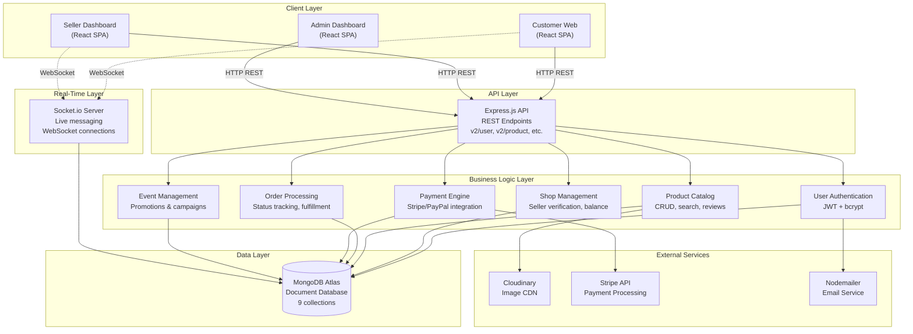
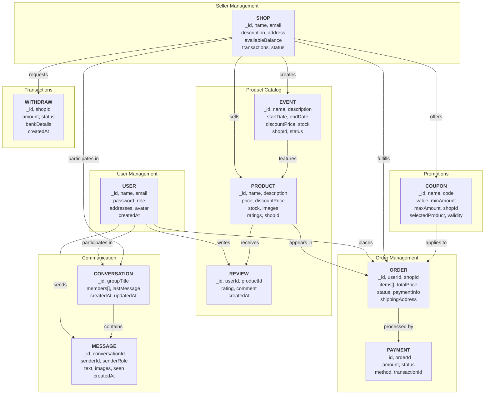
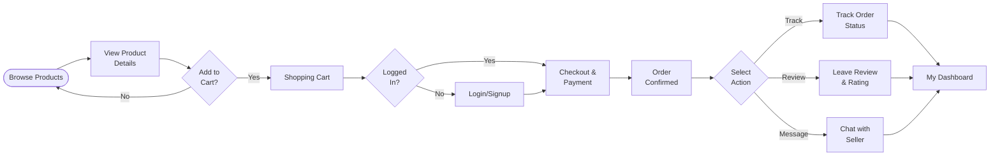
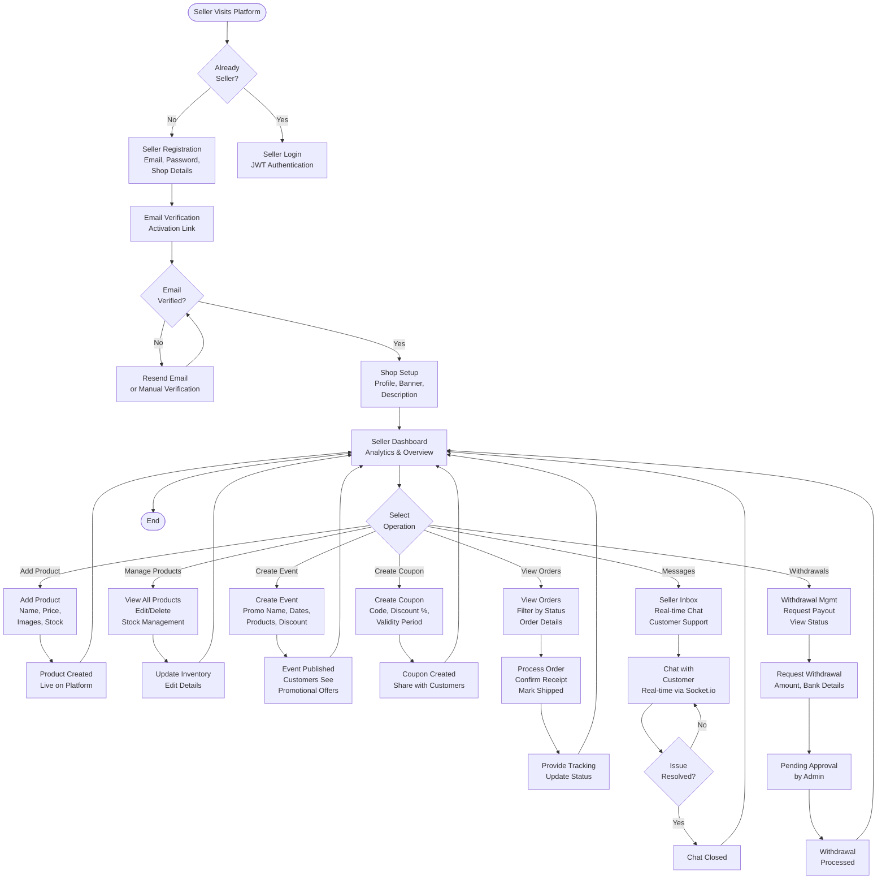
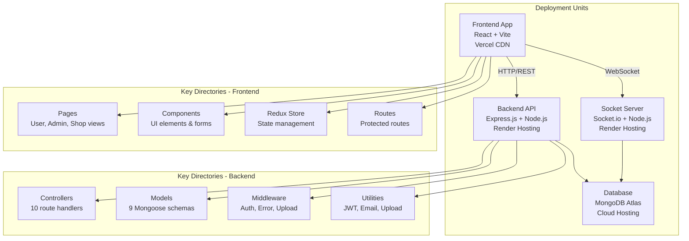

# oShop - Complete Case Study
## MultiVendor E-Commerce Platform ([Live](https://multi-vendor-ecom-seven.vercel.app))

---

## Executive Summary

**oShop** is a comprehensive, production grade multi-vendor e-commerce marketplace built with modern full-stack JavaScript technologies. The platform seamlessly connects three key stakeholders **customers**, **sellers**, and **platform administrators** through a unified digital ecosystem. 

### Key Value Propositions:
- **Decentralized Selling Model**: Empowers hundreds of independent sellers to manage their digital storefronts autonomously
- **Real-Time Communication**: Socket.io-powered instant messaging reduces friction in buyer-seller interactions
- **Enterprise Grade Architecture**: Scalable, cloud-native infrastructure handling concurrent users and multi-region deployments
- **Comprehensive Ecosystem**: Unified platform for product discovery, transactions, order management, and dispute resolution

---

## Project Goals & Objectives

### Primary Objectives
1. **Enable Multi-Vendor Marketplace**: Build a decentralized platform allowing unlimited sellers to operate independently without central management bottlenecks
2. **Deliver Seamless Customer Experience**: Create an intuitive, responsive interface enabling frictionless product discovery and checkout
3. **Facilitate Real-Time Seller Engagement**: Implement live communication channels reducing response times and improving customer satisfaction
4. **Ensure Secure Transactions**: Integrate PCI-compliant payment processors (Stripe, PayPal) for secure financial exchanges
5. **Provide Administrative Control**: Create comprehensive admin dashboards for platform governance, analytics, and compliance

### Secondary Objectives
- Implement role-based access control (Users, Sellers, Admins)
- Support promotional mechanics (Events, Coupons, Discounts)
- Enable seller performance tracking and withdrawal management
- Provide real-time inventory management and order tracking
- Create audit trails and dispute resolution mechanisms

---

## System Architecture

### High-Level System Architecture



---

## Database Design Architecture

### Database Schema Relationships



### Key Collections

| Collection | Purpose | Key Fields |
|-----------|---------|-----------|
| **Users** | Customer accounts & authentication | name, email, addresses, avatar, role |
| **Shops** | Seller storefront accounts | name, description, balance, withdrawal methods |
| **Products** | Catalog items | name, price, stock, images, reviews, shopId |
| **Orders** | Purchase transactions | items, totalPrice, status, paymentInfo, userId |
| **Events** | Promotional campaigns | name, startDate, products, discount |
| **CouponCodes** | Discount vouchers | code, discount percentage, validity, shopId |
| **Conversations** | Chat threads | members (array), lastMessage, createdAt |
| **Messages** | Message records | senderId, conversationId, content, images, seen |
| **Withdrawals** | Seller payouts | shopId, amount, status, bankDetails |

---

## Application Flow Diagrams

### Customer User Flow



### Seller Flow



### Admin Flow

```mermaid
graph TD
  AdminStart([Admin Logs In]) --> Verify["Admin Authentication<br/>Role-based Access<br/>JWT Token"]
  
  Verify --> AdminDash["Admin Dashboard<br/>Platform Analytics<br/>Overview Metrics"]
  
  AdminDash --> Management{Select<br/>Management<br/>Section}
  
  Management -->|User Management| UserMgmt["User Management<br/>View All Users<br/>Roles, Status"]
  Management -->|Seller Management| SellerMgmt["Seller Management<br/>Verify Sellers<br/>Suspend/Remove"]
  Management -->|Product Moderation| ProductMod["Product Moderation<br/>Review Listings<br/>Flag Inappropriate"]
  Management -->|Order Management| OrderMgmt["Order Management<br/>View All Orders<br/>Dispute Resolution"]
  Management -->|Payment Management| PaymentMgmt["Payment Analytics<br/>Transaction History<br/>Revenue Reports"]
  Management -->|Event & Coupon Mgmt| EventMgmt["Event/Coupon<br/>Monitor Campaigns<br/>Approve Promotions"]
  Management -->|Withdrawal Requests| WithdrawMgmt["Withdrawal Approval<br/>Review Requests<br/>Process Payouts"]
  Management -->|Reports & Analytics| Analytics["Platform Analytics<br/>Sales Reports<br/>User Metrics<br/>Performance KPIs"]
  
  UserMgmt --> UserActions{User<br/>Action}
  UserActions -->|View Details| UserDetail["User Profile<br/>Orders, Addresses,<br/>Activity Log"]
  UserActions -->|Manage| UserModerate["Ban/Suspend User<br/>Verify Status"]
  
  SellerMgmt --> SellerActions{Seller<br/>Action}
  SellerActions -->|View Profile| SellerDetail["Seller Details<br/>Shop Info, Products,<br/>Performance"]
  SellerActions -->|Verify| SellerVerify["Approve Seller<br/>or Request Documents"]
  SellerActions -->|Suspend| SellerSuspend["Suspend Shop<br/>for Violations"]
  
  ProductMod --> ModActions{Moderation<br/>Action}
  ModActions -->|Review| ReviewProd["Review Product<br/>Check Images,<br/>Description"]
  ModActions -->|Approve| ApproveProd["Approve Product<br/>List on Platform"]
  ModActions -->|Reject| RejectProd["Reject Product<br/>Notify Seller<br/>Request Revision"]
  
  OrderMgmt --> OrderActions{Order<br/>Action}
  OrderActions -->|View| ViewOrder["Order Details<br/>Items, Payment,<br/>Status"]
  OrderActions -->|Dispute| Dispute["Resolve Dispute<br/>Buyer vs Seller<br/>Issue Refund"]
  
  PaymentMgmt --> ViewPayment["Revenue Analytics<br/>Stripe Settlements<br/>Commission Tracking"]
  
  EventMgmt --> EventActions{Event<br/>Action}
  EventActions -->|Approve| ApproveEvent["Approve Event<br/>Feature Prominently"]
  EventActions -->|Reject| RejectEvent["Reject Event<br/>Reason"]
  
  WithdrawMgmt --> WithdrawActions{Withdrawal<br/>Action}
  WithdrawActions -->|Review| ReviewWith["Review Request<br/>Amount, Bank Info"]
  WithdrawActions -->|Approve| ApproveWith["Approve & Process<br/>Initiate Transfer"]
  WithdrawActions -->|Reject| RejectWith["Reject Request<br/>Request Info Update"]
  
  Analytics --> ViewMetrics["View KPIs<br/>Users, Revenue,<br/>GMV, Active Sellers"]
  
  UserDetail --> AdminDash
  UserModerate --> AdminDash
  SellerDetail --> AdminDash
  SellerVerify --> AdminDash
  SellerSuspend --> AdminDash
  ReviewProd --> AdminDash
  ApproveProd --> AdminDash
  RejectProd --> AdminDash
  ViewOrder --> AdminDash
  Dispute --> AdminDash
  ViewPayment --> AdminDash
  ApproveEvent --> AdminDash
  RejectEvent --> AdminDash
  ReviewWith --> AdminDash
  ApproveWith --> AdminDash
  RejectWith --> AdminDash
  ViewMetrics --> AdminDash
  
  AdminDash --> End([End Session])
```



---

## Project Structure Overview

The project is organized into four main deployment units, each serving distinct responsibilities:



**For detailed directory structure and file descriptions, refer to [PROJECT_STRUCTURE.md](PROJECT_STRUCTURE.md)**

---

## Core Features & Capabilities

### User Management
- **Authentication & Authorization**: JWT-based secure login with role-based access control (User, Seller, Admin)
- **User Profiles**: Account management, multiple shipping addresses, avatar upload
- **Email Verification**: Account activation and password reset mechanisms
- **Wallet & Order History**: Track purchases and transaction history

### Multi-Vendor Store Management
- **Independent Shops**: Each seller maintains autonomous storefront with branding
- **Shop Verification**: Admin approval workflow for seller accounts
- **Seller Dashboard**: Comprehensive analytics, order management, and performance metrics
- **Withdrawal System**: Sellers request payouts with secure bank account management

### Product Catalog & Inventory
- **Product Management**: CRUD operations with images, descriptions, pricing tiers
- **Inventory Tracking**: Real-time stock levels and automated low-stock alerts
- **Product Reviews & Ratings**: Customer feedback system with moderation
- **Search & Filtering**: Advanced product discovery with category, price, and rating filters
- **Image Management**: Cloudinary integration for optimized image delivery

### Shopping & Checkout
- **Shopping Cart**: Persistent cart with Redux state management
- **Checkout Flow**: Multi-step checkout with address entry and order review
- **Multiple Payment Methods**: Stripe and PayPal integration for payment processing
- **Order Tracking**: Real-time order status updates and delivery tracking

### Payment & Transactions
- **Stripe Integration**: PCI-compliant credit card processing
- **PayPal Integration**: Buyer account payment option
- **Payment Status Tracking**: Real-time payment confirmation and failure handling
- **Commission Management**: Automatic seller payment calculation

### Promotional Features
- **Timed Events**: Limited-time promotional campaigns with product bundles
- **Discount Coupons**: Shop-specific or platform-wide discount codes
- **Flash Sales**: Event-driven pricing with countdown timers
- **Discount Analytics**: Seller insights on coupon effectiveness

### Real-Time Communication
- **Live Chat**: Socket.io-powered instant messaging between buyers and sellers
- **Message Status**: Real-time message delivery and read indicators
- **Conversation Threading**: Organized chat history and multi-user conversations
- **Image Sharing**: Message-embedded image support

### Admin Dashboard
- **User Management**: View, suspend, or ban users
- **Seller Verification**: Review and approve seller accounts
- **Product Moderation**: Approve or reject product listings
- **Order Dispute Resolution**: Handle buyer-seller disputes and refunds
- **Financial Analytics**: Revenue tracking and seller payment management
- **Platform Metrics**: Real-time KPIs and performance analytics

### Security & Compliance
- **Password Hashing**: bcrypt encryption for stored passwords
- **CORS Protection**: Cross-origin request validation
- **JWT Tokens**: Secure stateless authentication
- **Role-Based Access**: Granular permission management
- **Input Validation**: Server-side validation for all inputs

---

## Technology Stack

### Frontend Technologies
| Layer | Technology | Purpose |
|-------|-----------|---------|
| **Framework** | React 19.2 | UI library for dynamic interfaces |
| **Build Tool** | Vite 7.2 | Fast module bundler and dev server |
| **Styling** | Tailwind CSS 4.1 | Utility-first CSS framework |
| **Component UI** | Material-UI 7.3 | Professional component library |
| **State Management** | Redux Toolkit 2.11 | Predictable state container |
| **HTTP Client** | Axios 1.13 | Promise-based HTTP client |
| **Routing** | React Router 7.13 | Client-side routing solution |
| **Real-Time** | Socket.io Client 4.8 | WebSocket client library |
| **Payments** | Stripe JS 8.11, PayPal JS 9.1 | Payment integration libraries |
| **Notifications** | React Toastify 11.0 | Toast notification system |
| **Animations** | Lottie 1.2 | JSON-based animation library |
| **Data Grid** | MUI DataGrid 8.27 | Advanced data table component |
| **Icons** | React Icons 5.5 | SVG icon library |

### Backend Technologies
| Layer | Technology | Purpose |
|-------|-----------|---------|
| **Runtime** | Node.js | JavaScript server runtime |
| **Framework** | Express.js 5.2 | Web application framework |
| **Database** | MongoDB 5.0+ | NoSQL document database |
| **ODM** | Mongoose 9.1 | MongoDB object modeling |
| **Authentication** | JWT (jsonwebtoken) 9.0 | JSON Web Token implementation |
| **Password Security** | bcrypt 6.0 | Password hashing library |
| **File Upload** | Multer 2.0 | Express middleware for file uploads |
| **Image Hosting** | Cloudinary SDK 2.9 | Cloud image storage & CDN |
| **Email Service** | Nodemailer 7.0 | Email sending utility |
| **Payments** | Stripe SDK 22.0 | Payment processing library |
| **Async Error Handling** | Custom middleware | Async/await error wrapper |
| **CORS** | CORS 2.8 | Cross-Origin Resource Sharing |
| **Cookie Parsing** | cookie-parser 1.4 | Cookie middleware for Express |
| **Environment** | dotenv 17.2 | Environment variable management |
| **Dev Tools** | nodemon 3.1 | Auto-restart dev server |

### Real-Time Communication
| Technology | Purpose | Details |
|-----------|---------|---------|
| **Socket.io 4.8** | Real-time bidirectional communication | WebSocket + fallbacks |
| **Node.js HTTP** | HTTP server for Socket.io | Native Node.js http module |

### Infrastructure & Deployment
| Service | Purpose | Details |
|---------|---------|---------|
| **MongoDB Atlas** | Database hosting | Cloud NoSQL database |
| **Cloudinary** | Image CDN | Image optimization & delivery |
| **Stripe API** | Payment processing | Credit card payments |
| **PayPal API** | Alternative payments | Account-based payments |
| **Render** | API Server hosting | Backend API deployment |
| **Render** | Socket Server hosting | Real-time server deployment |
| **Vercel** | Frontend hosting | React app CDN & edge functions |

---

## API Documentation Overview

The backend exposes a RESTful API organized into 10 main route modules:

### API Routes Structure

```
/api/v2/
├── /user           → User authentication, profile, password reset
├── /shop           → Seller registration, profile, verification
├── /product        → Product CRUD, search, reviews
├── /order          → Order creation, status tracking
├── /payment        → Payment processing (Stripe/PayPal)
├── /event          → Promotional event management
├── /coupon         → Discount coupon management
├── /message        → Direct messaging
├── /conversation   → Chat thread management
└── /withdraw       → Seller withdrawal requests
```

### Key API Endpoints (Examples)

#### Authentication
```
POST   /api/v2/user/register          → Create user account
POST   /api/v2/user/login             → Authenticate user
POST   /api/v2/user/logout            → End session
GET    /api/v2/user/profile           → Fetch user profile
PUT    /api/v2/user/update-profile    → Update profile info
POST   /api/v2/user/forgot-password   → Initiate password reset
```

#### Products
```
POST   /api/v2/product/create         → Add new product
GET    /api/v2/product/all            → List all products
GET    /api/v2/product/:id            → Get product details
PUT    /api/v2/product/:id            → Update product
DELETE /api/v2/product/:id            → Delete product
GET    /api/v2/product/search         → Search products
POST   /api/v2/product/:id/review     → Add review
```

#### Orders
```
POST   /api/v2/order/create           → Create new order
GET    /api/v2/order/all              → List user orders
GET    /api/v2/order/:id              → Get order details
PUT    /api/v2/order/:id/status       → Update order status
GET    /api/v2/order/track/:id        → Track order
```

#### Payments
```
POST   /api/v2/payment/stripe         → Process Stripe payment
POST   /api/v2/payment/paypal         → Process PayPal payment
GET    /api/v2/payment/history        → Payment history
```

#### Messaging
```
POST   /api/v2/conversation/create    → Start new chat
GET    /api/v2/conversation/all       → List conversations
POST   /api/v2/message/create         → Send message
GET    /api/v2/message/:conversationId → Fetch messages
```

**For complete API documentation including request/response schemas, see [PROJECT_STRUCTURE.md](PROJECT_STRUCTURE.md)**

---

## Deployment Architecture

### Frontend Deployment (Vercel)
- **Technology**: React + Vite
- **Deployment**: Vercel CLI and Git integration
- **Features**: Automatic previews, edge caching, serverless functions
- **Environment**: Production at `https://multi-vendor-ecom-seven.vercel.app`

### Backend API Deployment (Render)
- **Technology**: Express.js + Node.js
- **Deployment**: Git-connected deployment
- **Health Check**: `/test` endpoint returns "Hello world!"
- **Environment Variables**: Managed through Render dashboard
- **Database**: MongoDB Atlas connection string

### Real-Time Server Deployment (Render)
- **Technology**: Socket.io + Node.js
- **Port**: Configurable via environment
- **CORS**: Configured for Vercel frontend origin
- **Persistence**: MongoDB for message/conversation storage

### Database (MongoDB Atlas)
- **Collections**: 9 main collections (users, shops, products, orders, events, coupons, conversations, messages, withdrawals)
- **Backups**: Automated daily backups
- **Scalability**: Auto-scaling with increased load
- **Connection Pooling**: Mongoose connection pool management

---

## Known Issues & Recommendations

### Current Implementation Notes
1. **Error Handling**: Implement centralized error logging (Sentry/DataDog) for production
2. **Rate Limiting**: Add API rate limiting middleware to prevent abuse
3. **Caching**: Implement Redis caching for frequently accessed data (products, categories)
4. **Search Optimization**: Consider MongoDB Atlas Search for advanced full-text search
5. **Image Optimization**: Implement image compression before Cloudinary upload
6. **Security**: Add request validation using Joi or Zod for all API endpoints
7. **Testing**: Implement comprehensive Jest/Mocha test suites for critical paths
8. **Monitoring**: Set up APM (Application Performance Monitoring) for backend
9. **Payment Reconciliation**: Implement webhook verification for payment callbacks
10. **Database Indexes**: Review and optimize indexes based on query patterns

### Recommendations for Production
- **API Documentation**: Generate OpenAPI/Swagger documentation
- **Versioning Strategy**: Implement semantic versioning for API versions
- **Dependency Management**: Regular security audits using npm audit
- **Load Testing**: Use Apache JMeter or k6 for stress testing
- **Database Replication**: Enable MongoDB replication for high availability
- **CDN Configuration**: Optimize Cloudinary settings for different device sizes
- **Analytics**: Integrate Google Analytics and Mixpanel for user tracking

---

## Development Team

**Project Lead**: Sheraz Hussain  
**Architecture**: Full-stack JavaScript (MERN stack)  
**Last Updated**: April 2026

---

## Support & Documentation

For questions about specific components or implementation details:
- **Project Structure**: See [PROJECT_STRUCTURE.md](PROJECT_STRUCTURE.md)
- **Architecture Details**: Review system diagrams above
- **API Routes**: Check `/backend/controller/` directory for endpoint implementations
- **Database Schemas**: Review `/backend/model/` directory for data models

---

